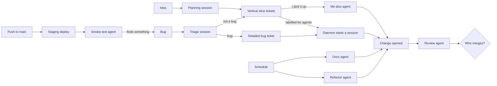
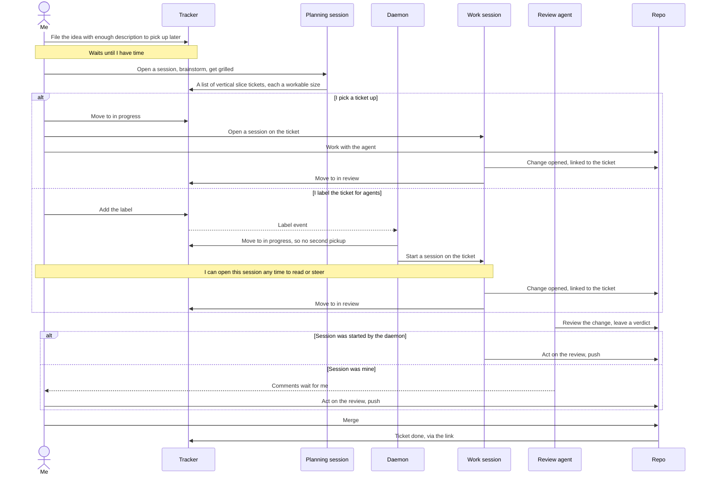
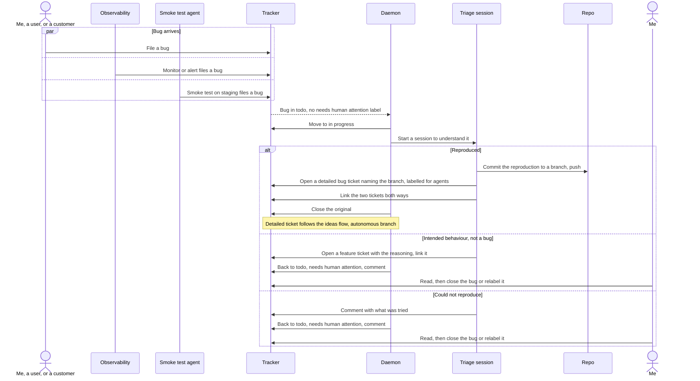
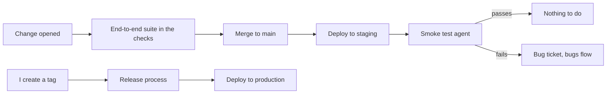
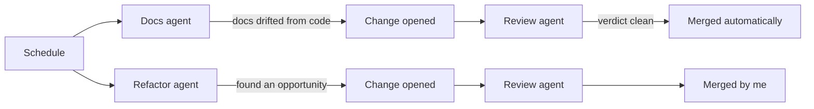

# My workflows

How I work with coding agents. Four kinds of work come in, each with its
own flow: ideas, bugs, releases, and maintenance. No tool is named here on
purpose. The flows should survive swapping any of them.

The rules that hold across all four:

- Every piece of work is a ticket. The ticket's status is the source of
  truth for where the work is. Nothing else keeps a copy.
- A session belongs to a ticket. Whether I started it or a daemon did, I can
  open it, read the conversation, and steer it.
- The daemon triages every bug without being asked, because triage changes
  no code. It implements only a ticket labelled for agents, because
  implementation does.
- One label, needs human attention, stops the daemon on any ticket. The
  daemon adds it when a session fails or triage cannot reproduce, and never
  closes a ticket. I remove it once I have looked.
- Every change is linked to its ticket, so merging the change closes the
  ticket on its own. No process has to notice a merge.
- Every change goes through a review agent before a human sees it, and the
  review's verdict is the gate for any automatic merge.
- I merge everything I touched. The system merges only what it started and
  what the review passed.

## Assumptions

The flows are written for one shape of project. Where a project has a
different shape, the ideas, bugs and maintenance flows still hold and the
release flow and the bug sources are the parts to swap.

- **One maintainer.** Every "me" is one person. On a team, who removes
  the stop label, who merges a change the daemon opened, and who owns a
  triaged bug each need an owner rule, and two people can claim the same
  ticket. Not solved here.
- **Trunk-based, with a main branch and pull requests.** Release branches
  and long-lived feature branches change the release flow.
- **A tracker with statuses, labels, and a link from a change to its
  ticket** that closes the ticket on merge.
- **Work that slices into one-session tickets** and verify commands that
  run in a fresh checkout. Tests that need a GPU, a device, a licensed
  toolchain, secrets, or an hour of wall clock break the autonomous
  branch. Exploratory work that does not slice up front stays hands-on.
- **A deployed service**, for the release flow and for bugs raised by
  observability. A library releases by publishing and has no staging. A
  CLI or desktop app has no staging URL. A mobile app has store review
  between the tag and users. None of those get bugs from a monitor.

Three things are inputs each repo supplies, not parts of the flow:

| Input | What it is | Examples |
| --- | --- | --- |
| Smoke flows | What the smoke test agent drives on staging | A login and a checkout for a web app. A publish and an install for a library. Nothing for a CLI |
| Doc list | Which docs the docs agent keeps in sync with the code | Agent docs, architecture diagrams, user docs, a changelog |
| What counts as a reproduction | What triage must produce before a bug is real | A failing test for logic. A screenshot diff for UI. A fixture and expected output for a pipeline. A benchmark and a threshold for performance |

## Ideas, features, enhancements

The planning session's output is tickets, not code. Each is a vertical
slice small enough for one session. That sizing is what makes the two
branches interchangeable: I can take one, an agent can take one, and the
change looks the same either way.

Moving the ticket to in progress is the claim. The daemon does it before
starting a session, so a second event for the same ticket finds it already
taken. Same status I set by hand when I pick one up, so the board reads the
same for both.

Review comments on a change I made wait for me. A change I made is one I
want to keep understanding, and the review is part of that. The daemon's
sessions act on their own reviews.

### When a daemon session fails

A session can crash, stall, run out of turns, or end with nothing to show.
The daemon then moves the ticket back to todo, adds the needs human
attention label, and leaves a comment saying what happened in the session.
The ticket is back where it was, with a note, and the daemon will not take
it again while the label is on. I decide whether to fix the ticket, take it
myself, or remove the label and let it go again. Nothing retries on its
own.

## Bugs

Triage comes before any fix because a bug report is a claim, not a fact.
Sometimes the behaviour is intended, and sometimes nobody can make it
happen again. In both cases the agent says so and stops. It closes
nothing. The ticket goes back to todo with the needs human attention
label and a comment, and I decide whether it really is intended or really
is unreproducible. Closing a bug is my call.

Triage and fix are two sessions. Reproducing a bug can eat most of a
context window on its own, and a fix started in what is left of that
window is worse than a fix started fresh. So triage ends at a ticket, and
the reproduction travels on a branch, not in the ticket text. For most
code that is a failing test; the repo says what counts (Assumptions).
Triage commits it to a branch, pushes it to the remote, and the detailed
ticket names that branch. The fix session starts its worktree from the
branch instead of main, with "make this pass" as its spec. The change it
opens carries two commits, the reproduction and the fix, which is what a
reviewer wants to see anyway. The branch has to be on the remote because
the two sessions may run in different places.

The fix change is reviewed like every other. The session acts on the
review itself. Whether the system or I merge it is still open, below.

## Releases

This is the deployed-service shape. A library, a CLI or a mobile app
swaps the staging half for its own publish step and keeps the tag.

The end-to-end suite runs on the change before it merges. Every merge to
main then deploys to staging on its own, and staging gets a smoke test
from an agent, not the full suite again. A failure there files a bug and
the bugs flow takes it.

Production is different: I create the tag, and the tag triggers the
release. I went back and forth on making the version bump automatic from
commit messages, and landed on keeping the tag in my hands for now. The
commit messages should still carry enough for the release notes to write
themselves.

## Maintenance

Two agents on a schedule. One checks that every doc on the repo's doc
list still matches the code. The other looks for refactoring
opportunities. Both open changes and both get
reviewed.

They merge differently. A docs change that passed review is safe to land
on its own, because it changes no behaviour. A refactor is code I will be
reading and changing later, so it goes through me, however small.

## Who merges what

The review verdict is the gate everywhere. Where the system merges, it
merges only on a clean verdict. Where I merge, the verdict is the first
thing I read. A size element may join the verdict later, but the verdict
is the part that exists first.

| Change came from | Acts on review | Merges |
| --- | --- | --- |
| Me, on any ticket | Me | Me |
| Daemon session, on a labelled ticket | The session | Me |
| Daemon session, on a triaged bug | The session | Open, see below |
| Docs agent | The session | The system, on a clean verdict |
| Refactor agent | The session | Me |

## Still open

- **Which bug fixes need a human merge.** Most should not. Some obviously
  do, and I do not yet have a rule for telling them apart.
- **How the observability side raises a bug.** A monitor, an alert, a
  process watching the platform. Not designed yet.
- **Open changes that fall behind.** When one change merges, its siblings
  fall behind main and some conflict. Who rebases and who resolves is not
  decided.
